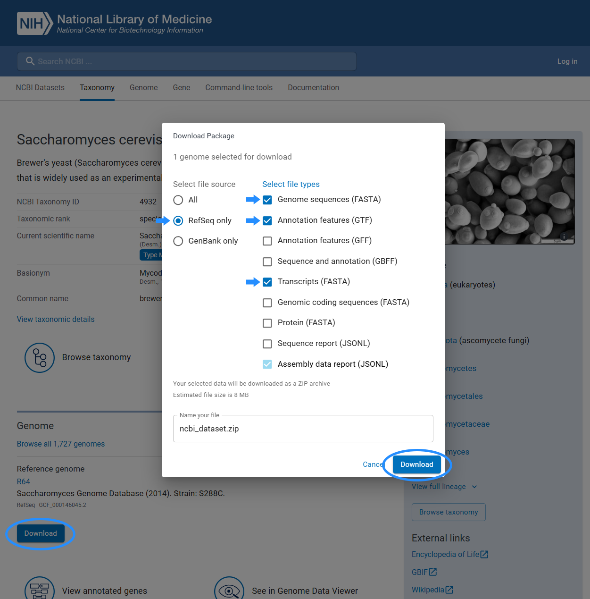

# Novabrowse

Description adding later


## Features

- **Automated gene retrieval** from NCBI using Entrez API
- **Multi-species BLAST searches** (blastn, tblastn, tblastx)
- **More coming later...**

## Prerequisites

### 1. Python 3.8+

Download from [python.org](https://www.python.org/downloads/)

### 2. Jupyter Notebook Environment

Novabrowse pipeline runs in a Jupyter Notebook, so you need a compatible program, for example:

- [VS Code](https://code.visualstudio.com/) with the [Jupyter extension](https://marketplace.visualstudio.com/items?itemName=ms-toolsai.jupyter)

### 3. NCBI BLAST+ Command Line Tools

BLAST+ must be installed and available in your system PATH.

**Option A: Conda (Recommended)**
```bash
conda install -c bioconda blast
```

**Option B: Manual Installation**
1. Download from [NCBI FTP](https://ftp.ncbi.nlm.nih.gov/blast/executables/blast+/LATEST/)
2. Install and add to system PATH

### 4. NCBI Entrez Email

NCBI requires an email address for Entrez API access. This is used to identify your requests and allows NCBI to contact you if there are problems.

**Register (optional but recommended):**
- Create an NCBI account at [ncbi.nlm.nih.gov/account](https://www.ncbi.nlm.nih.gov/account/)


## Installation

1. **Download the repository**

   **Option A: Clone with Git**
   ```bash
   git clone https://github.com/yourusername/novabrowse.git
   ```

   **Option B: [Download ZIP](https://github.com/yourusername/novabrowse/archive/refs/heads/main.zip)** and extract it

2. **Install Python dependencies**
   
   Open a terminal in the project folder and run:
   ```bash
   pip install -r requirements.txt
   ```
   
   > **Windows note:** If `pip` doesn't work, try `py -m pip install -r requirements.txt` instead.

## Quick Start & Tutorial

In Novabrowse:
- **Query species** - the species whose genes you want to search for (your genes of interest)
- **Subject species** - the species you search against to find homologous matches

### 1. Prepare subject species files

Novabrowse supports both transcriptome and genome analysis. For each subject species, you'll need:

- **GTF annotation file** (Gene Transfer Format) - contains gene coordinates, names, and transcript information. The GTF must follow NCBI formatting conventions, but doesn't have to be downloaded from NCBI.
- **FASTA sequence file** - either transcriptome (`rna.fna`) or genome (`genomic.fna`) depending on your analysis needs.

For this tutorial, we'll use three fungal species from NCBI:

| Species | NCBI Link |
|---------|-----------|
| *Saccharomyces cerevisiae* | [Download](https://www.ncbi.nlm.nih.gov/datasets/taxonomy/4932/) |
| *Schizosaccharomyces pombe* | [Download](https://www.ncbi.nlm.nih.gov/datasets/taxonomy/4896/) |
| *Candida albicans* | [Download](https://www.ncbi.nlm.nih.gov/datasets/taxonomy/5476/) |

For this tutorial, we downloaded GTF annotation files and transcript files for all three species, and additionally the genome file for *S. cerevisiae*.

**Downloading from NCBI:**



<sub>For this tutorial we use **RefSeq** (NCBI Reference Sequence) assemblies, which are curated. You can choose the source (RefSeq or GenBank) based on your specific research needs.</sub>

Place the downloaded files in:
```
1_subject_sequences/<custom_name>/<assembly>/
├── genomic.gtf      # Required: GTF annotation file
├── rna.fna          # For transcriptome analysis
└── genomic.fna      # For genome analysis
```

Example for *S. cerevisiae*:
```
1_subject_sequences/s_cerevisiae/GCF_000146045.2/
├── genomic.gtf
├── rna.fna
└── GCF_000146045.2_R64_genomic.fna
```

### 2. Create subject species BLAST databases

Open `make_blastdb.ipynb` and edit the second cell to add your species, then run the notebook.
```python
run_makeblastdb(
    "1_subject_sequences\\<custom_name>\\<assembly>\\rna.fna",
    "nucl",
    "2_subject_blastdb\\<custom_name>_<assembly>"
)
```

Example for *S. cerevisiae*:
```python
run_makeblastdb(
    "1_subject_sequences\\s_cerevisiae\\GCF_000146045.2\\rna.fna",
    "nucl",
    "2_subject_blastdb\\s_cerevisiae_GCF_000146045.2"
)
```

### 3. Generate chromosome data file

Open `get_chromosome_info.ipynb` and edit:

1. Set your NCBI Entrez email:
   ```python
   Entrez.email = "your.email@example.com"
   ```

2. Add your species to `ASSEMBLY_MAPPING`:
   ```python
   ASSEMBLY_MAPPING = {
       '<custom_name>': '<assembly>',
   }
   ```

   Example for *S. cerevisiae*:
   ```python
   ASSEMBLY_MAPPING = {
       's_cerevisiae': 'GCF_000146045.2',
   }
   ```

Then run the notebook. It will query NCBI for chromosome accessions and lengths for each species and save the results to `chromosome_data.json`.

This file is used for mapping genes onto chromosomes.

**Important:** Both query and subject species must be included. If NCBI doesn't have chromosome information for a species, you'll need to add it manually to `chromosome_data.json`.

### 4. Configure Novabrowse

Open `novabrowse_0.1.ipynb`. This is the main notebook that:
1. Downloads query species sequences for your specified genomic region
2. Runs BLAST searches against your subject species
3. Generates interactive HTML result files

**Setting up a query:**

To analyze a genomic region, you need to first set the chromosome name and region of interest coordinates.

For example, to study the ACT1 gene locus (actin, highly conserved) in *S. cerevisiae*:
1. Search "ACT1 S. cerevisiae" on NCBI


2. Find the genomic location: `Chromosome: VI; NC_001138.5 (53260..54696, complement)`
3. Use chromosome `VI`, start `53260`, end `54696`
4. Set upstream/downstream genes to include flanking genes (e.g., 5 each)

Configure the first cell:
```python
title = "ACT1_synteny"

query_sequences_list = [
    {
        'query_species': 's_cerevisiae',           # Species name (must match ASSEMBLY_MAPPING key)
        'protein_sources': ('NP_','XP_'),          # Filter by protein accession prefix
        'show_only_best_matches': 'True',          # Show only top hit per subject species
        'retrieved_sequences': {
            'download_from_NCBI': True,            # Fetch sequences from NCBI
            'query_chromosome': 'VI',              # Chromosome name
            'start_position': 53260,               # Region start coordinate
            'end_position': 54696,                 # Region end coordinate
            'genes_upstream': 5,                   # Include also 5 genes before the region
            'genes_downstream': 5,                 # Include also 5 genes after the region
        },
    },
]
```

> **Note:** The `query_species` value must match the name you used in `ASSEMBLY_MAPPING` (step 3) and your folder name in `1_subject_sequences/`.

### 5. Configure BLAST settings

Choose which BLAST algorithm(s) to use:
- `blastn` - nucleotide vs nucleotide
- `tblastn` - protein vs translated nucleotide
- `tblastx` - translated nucleotide vs translated nucleotide

You can enable multiple types at once - a separate result file will be generated for each:

```python
blast_settings = {
    'blast_type': ['tblastn', 'blastn'],  # Two result files will be generated
    'blast_options': '-evalue 1e-10 -outfmt 0 -num_threads 48'
}
```

### 6. Select subject species

Configure which species to search against. Each species can be configured separately:

**Subject Species Parameters:**

| Parameter | Description |
|-----------|-------------|
| `enabled` | `True` to include this species in BLAST search, `False` to skip |
| `maximum_evalue` | E-value threshold - only hits with e-value ≤ this value are kept (e.g., `1e-10`) |
| `minimum_score` | Minimum BLAST bit score - hits below this score are filtered out (0 = no minimum) |
| `additional_blast_parameters` | Extra BLAST command-line options for this species only (e.g., `'-word_size 11'`) |
| `type` | Database type: `'transcriptome'` (search rna.fna) or `'genome'` (search genomic.fna) |

> **Note:** Per-species `maximum_evalue` and `minimum_score` settings override the general values in `blast_options`.

```python
subject_species = {
   's_cerevisiae': {
       'enabled': False,        # Skip searching against query species
       'maximum_evalue': 1e-10,
       'minimum_score': 0,
       'additional_blast_parameters': '',
       'type': 'transcriptome'
   },
   's_pombe': {
       'enabled': True,         # Search this species
       'maximum_evalue': 1e-10,
       'minimum_score': 0,
       'additional_blast_parameters': '',
       'type': 'transcriptome'
   },
   'c_albicans': {
       'enabled': True,         # Search this species
       'maximum_evalue': 1e-10,
       'minimum_score': 0,
       'additional_blast_parameters': '',
       'type': 'transcriptome'
   },
}
```

### 7. Map species to NCBI organism names

Map each species name to its NCBI organism name (used for Entrez queries and display names in results):

```python
species_to_orgn = {
    's_cerevisiae': 'Saccharomyces cerevisiae[ORGN]',
    's_pombe': 'Schizosaccharomyces pombe[ORGN]',
    'c_albicans': 'Candida albicans[ORGN]',
}
```

> **Tip:** Set the query species to `enabled: False` to avoid self-hits. You typically want to search other species, not your query species against itself.

### 8. Run all notebook cells sequentially

### 9. Find results in the project root folder as interactive HTML files

Example output files:
- `Novabrowse_ACT1_synteny_s_cerevisiae_blastn_best_matches.html` - blastn results
- `Novabrowse_ACT1_synteny_s_cerevisiae_tblastn_best_matches.html` - tblastn results

<br>


### 10. There are lot of other permutations of settings we should demonstrate, need to think about what would be most effective. Also how to add the tool functionality descriptions


<br><br><br><br>

## Troubleshooting

### "HTTP Error 400" from NCBI
- Reduce the genomic region size or number of upstream/downstream genes
- NCBI API has limits on query size (~8-10 MB)

### "makeblastdb not found"
- Ensure BLAST+ is installed and in your PATH
- Try running `makeblastdb -version` to verify

### No genes found
- Check that the chromosome format matches NCBI naming
- Verify genomic coordinates are correct for your assembly version

## License

MIT License - see [LICENSE](LICENSE) for details.

## Citation

If you use Novabrowse in your research, please cite:
```
[Citation information to be added]
```

## Contributing

Contributions are welcome! Please feel free to submit a Pull Request.
