**Novabrowse is an interactive BLAST results interpretation tool and sequence alignment viewer for multi-species synteny analysis, ortholog finder, and chromosome mapping.**

Find gene position on chromosome, generate synteny plots across multiple species, interpret BLAST alignments with coverage and identity visualizations, and discover unannotated genes through genomic signal analysis.

## Table of Contents

- [How Novabrowse Works](#how-novabrowse-works)
- [Why Choose Novabrowse](#why-choose-novabrowse)
- [Getting Started](#getting-started)
- [Installation Prerequisites](#installation-prerequisites-jupyter-notebook)
- [Installation](#installation-jupyter-notebook)
- [Try It Quickly](#try-it-quickly-jupyter-notebook)
- [Setup](#setup-jupyter-notebook)
- [Tutorial 1: Detecting Orthologs Across Species](#tutorial-1-detecting-orthologs-across-species)
- [Tutorial 2: Using Custom Sequences and Gene Signal Discovery](#tutorial-2-using-custom-sequences-and-gene-signal-discovery)
- [Documentation](#documentation)
  - [General Features](#general-features)
  - [Pipeline Overview](#pipeline-overview)
  - [Basic Output Overview](#basic-output-overview)
  - [Parameters Reference](#parameters-reference)
  - [UI Controls](#ui-controls)
  - [Chromosome Filter](#chromosome-filter)
  - [Interactivity Features](#interactivity-features)
  - [Ribbon Plot Features](#ribbon-plot-features)
- [Troubleshooting](#troubleshooting)
- [FAQ](#faq)
- [License](#license)
- [Citation](#citation)
- [Contributing](#contributing)


## How Novabrowse Works
1\. You define a genomic region of interest, Novabrowse retrieves the gene sequences and runs BLAST searches against chosen subject species:

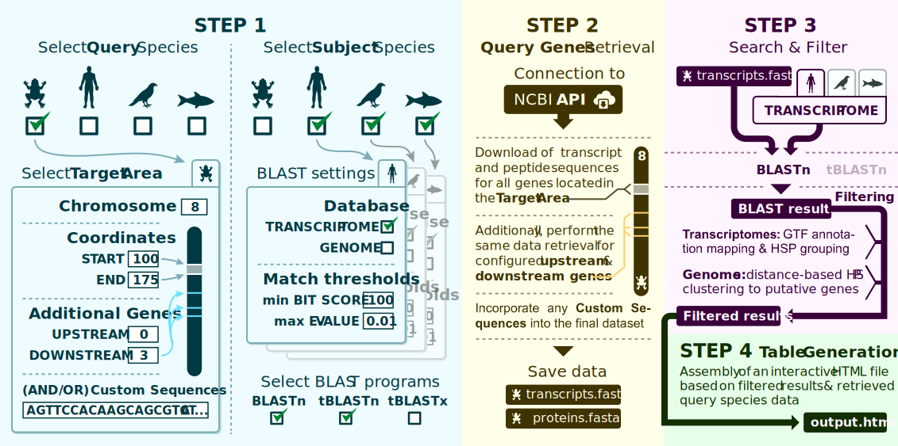

2\. The results are combined into an interactive HTML table with synteny ribbons and chromosome maps:

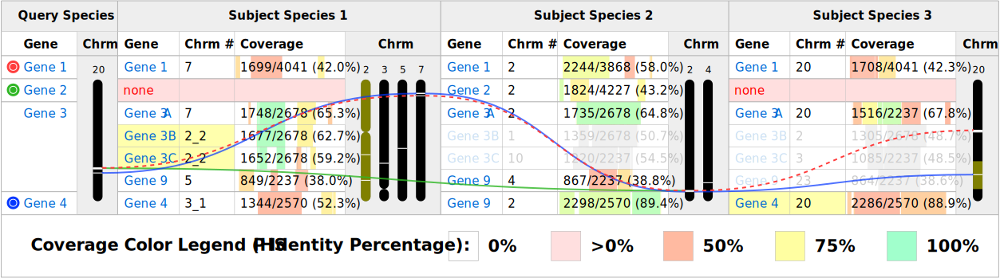

> For a more detailed breakdown, see [Pipeline Overview](#pipeline-overview) and [Basic Output Overview](#basic-output-overview).

## Why Choose Novabrowse

Novabrowse is free and open source ([MIT License](#license)) and ships with several novel core capabilities along with features not found together in any other comparative genomics tool:
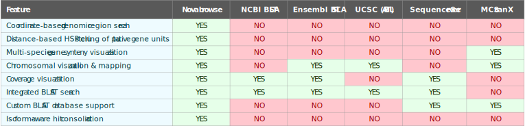

- **Coordinate-based genomic region search** - Define a chromosomal region by coordinates and automatically retrieve gene sequences from that region for use as search queries
- **Distance-based HSP clustering of putative gene units** - Identify unannotated genes in genomic regions through distance-based High-scoring Segment Pair (HSP) clustering, revealing gene units missed by standard annotation pipelines
- **Multi-species gene synteny visualization** - Compare gene order conservation across multiple species simultaneously with interactive ribbon plots connecting orthologous genes across chromosomes
- **Chromosomal visualization & mapping** - Display hit locations on chromosome ideograms, providing genomic context for alignment results
- **Coverage visualization** - View alignment coverage as identity-color-coded bars positioned along query sequences, showing both extent and quality of matches
- **Integrated BLAST search** - Natively executes BLAST searches within the pipeline, no need to run BLAST separately and import results
- **Custom BLAST database support** - Use your own BLAST databases built from any FASTA sequences, not limited to pre-built databases
- **Isoform-aware hit consolidation** - Consolidates multiple transcript isoform hits into single gene entries, preventing duplicate results from the same locus

## Getting Started

Novabrowse can be run in three ways: using a Jupyter Notebook or from the command line using Docker or Apptainer containers. The containerized methods include all dependencies and support running on HPC (High-Performance Computing) clusters.

After the initial setup (preparing subject species files, creating BLAST databases, and generating chromosome data), running analyses themselves is quick and straightforward.

| Method | Setup guide |
|--------|-------------|
| **Jupyter Notebook** | [Installation Prerequisites](#installation-prerequisites-jupyter-notebook) (below) |
| **Docker** | [Docker Setup](docker/README.md) (in `docker/` folder) |
| **Apptainer** | [Apptainer Setup](docker/README.md#apptainer) (in `docker/` folder) |


## Installation Prerequisites (Jupyter Notebook)

### 1. Python 3.8+

Download from [python.org](https://www.python.org/downloads/)

### 2. Jupyter Notebook Environment

Novabrowse pipeline runs in a Jupyter Notebook, so you need a compatible program, for example:

- [VS Code](https://code.visualstudio.com/) with the [Jupyter extension](https://marketplace.visualstudio.com/items?itemName=ms-toolsai.jupyter)

### 3. <a href="https://www.ncbi.nlm.nih.gov/" target="_blank">NCBI</a> BLAST+ Command Line Tools

BLAST+ must be installed and available in your system PATH.

**Option A: Conda**
```bash
conda install -c bioconda blast
```

**Option B: Homebrew (macOS)**
```bash
brew install blast
```

**Option C: Manual Installation**
1. Download from [NCBI FTP](https://ftp.ncbi.nlm.nih.gov/blast/executables/blast+/LATEST/)
2. Install and add to system PATH
3. On Linux, if you get a missing library error, install the OpenMP runtime: `sudo apt install libgomp1` (Debian/Ubuntu) or `sudo yum install libgomp` (RHEL/CentOS)

### 4. NCBI Account

Novabrowse uses the [NCBI Entrez API](https://www.ncbi.nlm.nih.gov/books/NBK25501/) to retrieve sequences, which requires an NCBI account:
- You can create the account at [ncbi.nlm.nih.gov/account](https://www.ncbi.nlm.nih.gov/account/)
- The email associated with your NCBI account will also be used to identify your Entrez API requests


## Installation (Jupyter Notebook)

1. **Download the repository**

   **Option A: Clone with Git**
   ```bash
   git clone https://github.com/RegenImm-Lab/Novabrowse.git
   ```

   **Option B: [Download ZIP](https://github.com/RegenImm-Lab/Novabrowse/archive/refs/heads/main.zip)** and extract it

2. **Install Python dependencies**

   Open a terminal in the project folder and run:
   ```bash
   pip install -r requirements.txt
   ```

   This installs Biopython and certifi (for SSL certificate handling).

   > **Windows note:** If `pip` doesn't work, try `py -m pip install -r requirements.txt` instead.

## Try It Quickly (Jupyter Notebook)

The repository comes pre-configured with three example species (*S. cerevisiae*, *S. pombe*, *C. albicans*) with BLAST databases and chromosome data included. To run the example analysis:

1. Open `novabrowse_1.0.ipynb` and find `entrez_email = None` under the "General Setup" section (cell 2)
2. Replace `None` with your [NCBI account](https://www.ncbi.nlm.nih.gov/account/) email:
   ```python
   entrez_email = "you@email.com"
   ```
3. Run the notebook. Results will be in the `output/` folder as HTML files

To learn how to add your own species and configure analyses, see [Setup](#setup-jupyter-notebook) below.

## Setup (Jupyter Notebook)

In Novabrowse:
- **Query species** - the species whose genes you want to search for (your genes of interest)
- **Subject species** - the species you search against to find homologous matches

### 1. Prepare subject species files

Novabrowse supports both transcriptome and genome analysis. For each subject species, you'll need:

- **GTF annotation file** (Gene Transfer Format) - contains gene coordinates, names, and transcript information. The GTF must follow NCBI formatting conventions, but can come from any source (e.g., NCBI, Ensembl, or your own custom annotations).
- **FASTA sequence file** - either transcriptome (`rna.fna`) or genome (`genomic.fna`) depending on your analysis needs. These can also be custom assemblies as long as they match the GTF.

Place the downloaded files in:
```
1_subject_sequences/<custom_name>/<assembly>/
├── genomic.gtf       # Required: GTF annotation file
├── rna.fna           # For transcriptome analysis (exact filename required)
└── *_genomic.fna     # For genome analysis (must contain "_genomic" in filename)
```

> **Note:** The transcriptome file **must** be named exactly `rna.fna`. Genome files **must** contain `_genomic` in the filename (e.g., `GCF_000146045.2_R64_genomic.fna`).

For instructions on how to download these files from NCBI, see [How to download subject species sequences from NCBI](#subject-species-used-in-this-tutorial) in Tutorial 1.

### 2. Create subject species BLAST databases

Open `make_blastdb.ipynb` and edit the second cell to add your species, then run the notebook.
```python
run_makeblastdb(
    "1_subject_sequences/<custom_name>/<assembly>/rna.fna",
    "nucl",
    "2_subject_blastdb/<custom_name>_<assembly>"
)
```

For example, if you placed *S. cerevisiae* files in step 1 like this:
```
1_subject_sequences/s_cerevisiae/GCF_000146045.2/
├── genomic.gtf
├── rna.fna
└── GCF_000146045.2_R64_genomic.fna
```

The corresponding `make_blastdb` calls would be:
```python
# Transcriptome database
run_makeblastdb(
    "1_subject_sequences/s_cerevisiae/GCF_000146045.2/rna.fna",
    "nucl",
    "2_subject_blastdb/s_cerevisiae_GCF_000146045.2"
)

# Genome database
run_makeblastdb(
    "1_subject_sequences/s_cerevisiae/GCF_000146045.2/GCF_000146045.2_R64_genomic.fna",
    "nucl",
    "2_subject_blastdb/s_cerevisiae_GCF_000146045.2_genome"
)
```

### 3. Set up NCBI email

The NCBI Entrez API requires an email address to identify requests. If you don't have an NCBI account yet, create one at [ncbi.nlm.nih.gov/account](https://www.ncbi.nlm.nih.gov/account/).

**Option A: Set system environment variable (Recommended)**

This keeps your email out of the code and works automatically.

*Windows (Command Prompt):*
```cmd
setx ENTREZ_EMAIL_ENV "your.email@example.com"
```

*Windows (PowerShell):*
```powershell
[System.Environment]::SetEnvironmentVariable("ENTREZ_EMAIL_ENV", "your.email@example.com", "User")
```

*macOS:*
```bash
echo 'export ENTREZ_EMAIL_ENV="your.email@example.com"' >> ~/.zshrc
source ~/.zshrc
```

*Linux:*
```bash
echo 'export ENTREZ_EMAIL_ENV="your.email@example.com"' >> ~/.bashrc
source ~/.bashrc
```

> **Note:** After setting the environment variable, restart your terminal/IDE for changes to take effect.

---

**Option B: Set directly in the notebooks**

In both `get_chromosome_info.ipynb` and `novabrowse_1.0.ipynb`, change `entrez_email = None` to your email:
```python
entrez_email = "your.email@example.com"
```

> **Note:** If both the environment variable and the notebook value are set, the environment variable takes priority.

### 4. Generate chromosome data file

Open `get_chromosome_info.ipynb` and add your species to `ASSEMBLY_MAPPING`.
```python
ASSEMBLY_MAPPING = {
    '<custom_name>': '<assembly>',
}
```

Example for *S. cerevisiae*:
```python
ASSEMBLY_MAPPING = {
    's_cerevisiae': 'GCF_000146045.2',
}
```

Then run the notebook. It will query NCBI for chromosome accessions and lengths for each species and save the results to `chromosome_data.json`.

This file is used for mapping genes onto chromosomes.

**Important:** `chromosome_data.json` must contain entries for all species used in the analysis (both query and subject). If NCBI doesn't have chromosome information for a species, you'll need to add it manually (see [Chromosome Data Format](#chromosome-data-format) for the expected structure).

### 5. Configure and run Novabrowse

Open `novabrowse_1.0.ipynb`. This is the main notebook that:
1. Downloads query species sequences for your specified genomic region
2. Runs BLAST searches against your subject species
3. Generates interactive HTML result files

Edit the first cell to configure your analysis. In this example, we set up a search for orthologs of the *ACT1* gene in *S. cerevisiae*, searching against *S. pombe* (transcriptome) and *S. cerevisiae* itself (transcriptome and genome):

```python
title = "ACT1_orthology"                    # Prefix for output files

query_sequences_list = [
    {
        'query_species': 's_cerevisiae',     # Must match ASSEMBLY_MAPPING key
        'protein_sources': ('NP_', 'XP_'),   # Protein accession prefixes to include
        'show_only_best_matches': 'True',    # 'True', 'False', or 'Both'
        'retrieved_sequences': {
            'download_from_NCBI': True,      # Fetch sequences from NCBI
            'chromosome': 'VI',              # E.g. '2', '2p', 'VI', or 'NC_001138.5'
            'start_position': 53260,         # Region start coordinate
            'end_position': 54696,           # Region end coordinate
            'genes_upstream': 5,             # Include 5 genes before the region
            'genes_downstream': 5,           # Include 5 genes after the region
        },
    },
]

# Max distance (bp) between genomic BLAST HSPs to merge into one gene unit
consider_one_gene = 1050

blast_settings = {
    'blast_type': ['tblastn', 'blastn'],     # Search algorithm(s)
    'blast_options': '-outfmt 0 -num_threads 48'  # BLAST command-line options
}

subject_species = {
    's_pombe': {
        'enabled': True,                     # Include in search
        'maximum_evalue': 1e-10,             # E-value threshold
        'minimum_score': 0,                  # Minimum bit score (0 = no minimum)
        'additional_blast_parameters': '',   # Extra BLAST parameters for this species
        'type': ['transcriptome']            # Transcriptome only
    },
    's_cerevisiae': {
        'enabled': False,                    # Skip (query species)
        'maximum_evalue': 1e-10,
        'minimum_score': 0,
        'additional_blast_parameters': '',
        'type': ['transcriptome', 'genome']  # Both transcriptome and genome
    },
}
```

For detailed explanations of each parameter and how to set up different types of analyses, see [Tutorial 1](#tutorial-1-detecting-orthologs-across-species) and [Tutorial 2](#tutorial-2-using-custom-sequences-and-gene-signal-discovery), which walk through the full process from downloading subject species files to rendering the final output. A complete [Parameters Reference](#parameters-reference) is also available below.

## Tutorial 1: Detecting Orthologs Across Species

This tutorial demonstrates how to identify orthologous genes across multiple species. You'll search for orthologs of a target gene and the genes flanking it on both sides, then visualize their chromosomal positions across species.

**What you'll learn:**
- How to define a genomic region of interest in the query species
- Configure BLAST searches against multiple subject species

### Subject species used in this tutorial

We'll use three fungal species from NCBI:

| Species | NCBI Link |
|---------|-----------|
| *Saccharomyces cerevisiae* | [Open](https://www.ncbi.nlm.nih.gov/datasets/taxonomy/4932/) |
| *Schizosaccharomyces pombe* | [Open](https://www.ncbi.nlm.nih.gov/datasets/taxonomy/4896/) |
| *Candida albicans* | [Open](https://www.ncbi.nlm.nih.gov/datasets/taxonomy/5476/) |

These files (GTF annotations and transcripts for all three species, plus the genome for *S. cerevisiae*) are already included in `1_subject_sequences/`. Below we explain how they were downloaded, which you can follow to add your own species or update the existing files.

**How to download subject species sequences from NCBI:**

The image below shows *S. cerevisiae* as an example. When downloading assemblies from NCBI, you can choose the source (RefSeq or GenBank) based on your specific research needs.


Example directory structure for *S. cerevisiae*:
```
1_subject_sequences/s_cerevisiae/GCF_000146045.2/
├── genomic.gtf
├── rna.fna
└── GCF_000146045.2_R64_genomic.fna
```

### 1. Setting up a query
**In this example scenario:** We'll examine the *ACT1* locus (encoding actin) in *S. cerevisiae* and find its orthologous loci in *S. pombe* and *C. albicans*.

To analyze a genomic region, first identify the chromosome and coordinates of your region of interest.

To find coordinates for the *ACT1* gene locus in *S. cerevisiae*:
1. Search for *S. cerevisiae* [*ACT1*](https://www.ncbi.nlm.nih.gov/gene/850504) gene on NCBI

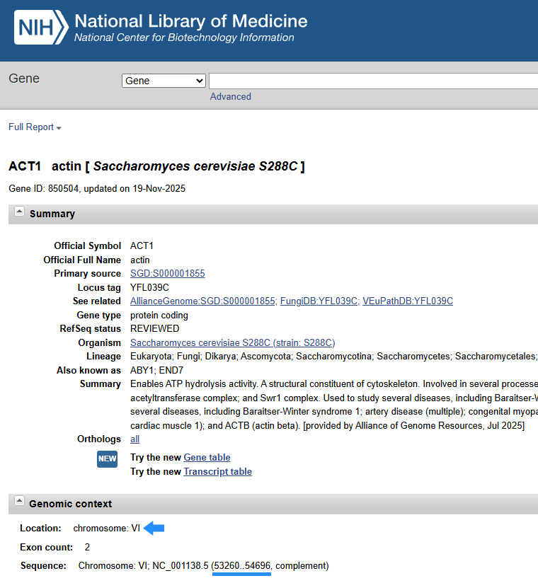

2. Find the genomic location: `Chromosome: VI; NC_001138.5 (53260..54696, complement)`


Configure the first cell of `novabrowse_1.0.ipynb` (when running via Docker or Apptainer, these same parameters are set in `novabrowse_config.yaml` instead):
```python
title = "ACT1_orthology" # Prefix for output files from this run

query_sequences_list = [
    {
        'query_species': 's_cerevisiae',           # Species name (must match ASSEMBLY_MAPPING key)
        'protein_sources': ('NP_','XP_'),          # See Protein Source Prefixes
        'show_only_best_matches': 'True',          # Allowed values: 'True', 'False', 'Both'
        'retrieved_sequences': {
            'download_from_NCBI': True,            # Fetch sequences from NCBI
            'chromosome': 'VI',                    # Allowed types: '6', '6q', 'VI' or 'NC_001138.5'
            'start_position': 53260,               # Region start coordinate
            'end_position': 54696,                 # Region end coordinate
            'genes_upstream': 5,                   # Include 5 genes before the region
            'genes_downstream': 5,                 # Include 5 genes after the region
        },
    },
]
```
1. Use chromosome `VI` and the corresponding start `53260` and end `54696` coordinates of *ACT1*.
2. Set upstream/downstream genes to include flanking genes (e.g., 5 each)

> **Note:** The `query_species` value must match the name you used in `ASSEMBLY_MAPPING` (step 3) and your folder name in `1_subject_sequences/`.

> **Chromosome identifiers:** You can use traditional chromosome names (`'VI'`, `'2'`, `'2p'`, `'II'`) or NCBI accession identifiers (`'NC_001138.5'`, `'NC_032095.1'`). Accession identifiers support version-flexible matching - for example, `'NC_032095'` will match `'NC_032095.1'`. Use accession identifiers when traditional names don't work or for more precise targeting.

> **Adaptive range fetching:** The `genes_upstream` and `genes_downstream` parameters use adaptive range searching. Novabrowse automatically expands the search window to find exactly the requested number of genes, regardless of gene density in the region.

> **Output file types:** The `show_only_best_matches` parameter controls which output files are generated:
> - `'True'` — generates `*_best_matches.html` with only the top hit per gene
> - `'False'` — generates `*_all_matches.html` with all hits including paralogs
> - `'Both'` — generates both files

### 2. Configure BLAST settings

Choose which BLAST algorithm(s) to use:
- `blastn` - nucleotide vs nucleotide (best for closely related species)
- `tblastn` - protein vs translated nucleotide (most common for cross-species analysis)
- `tblastx` - translated nucleotide vs translated nucleotide (for divergent species)

You can enable multiple types at once - a **separate result file will be generated for each combination** of BLAST type and database type:

```python
blast_settings = {
    'blast_type': ['tblastn', 'blastn'],  # Two result files per species/database combination
    'blast_options': '-outfmt 0 -num_threads 48'
}
```

For example, with 2 subject species configured with `'type': ['transcriptome', 'genome']` and 2 BLAST types, you'll get 8 total result files (2 species × 2 database types × 2 BLAST types).

### 3. Select subject species

Configure which species to search against. Each species can be configured separately:

**Subject Species Parameters:**

| Parameter | Description |
|-----------|-------------|
| `enabled` | `True` to include this species in BLAST search, `False` to skip |
| `maximum_evalue` | E-value threshold - only hits with e-value ≤ this value are kept (e.g., `1e-10`) |
| `minimum_score` | Minimum BLAST bit score - hits below this score are filtered out (0 = no minimum) |
| `additional_blast_parameters` | Extra BLAST command-line options for this species only (e.g., `'-word_size 11'`) |
| `type` | Database type(s) as list: `['transcriptome']`, `['genome']`, or `['transcriptome', 'genome']` for both |

> **Note:** Per-species `maximum_evalue` and `minimum_score` settings override the general values in `blast_options`.

```python
subject_species = {
   's_cerevisiae': {
       'enabled': False,        # Skip searching against query species
       'maximum_evalue': 1e-10,
       'minimum_score': 0,
       'additional_blast_parameters': '',
       'type': ['transcriptome']
   },
   's_pombe': {
       'enabled': True,         # Search this species
       'maximum_evalue': 1e-10,
       'minimum_score': 0,
       'additional_blast_parameters': '',
       'type': ['transcriptome']
   },
   'c_albicans': {
       'enabled': True,         # Search this species
       'maximum_evalue': 1e-10,
       'minimum_score': 0,
       'additional_blast_parameters': '',
       'type': ['transcriptome']
   },
}
```
> **Note:** When using `['transcriptome', 'genome']`, separate result files are generated for each database type.
> **Tip:** Set the query species to `enabled: False` to avoid self-hits. You typically want to search other species, not your query species against itself.

### 4. Map species to NCBI organism names

Map each species name to its NCBI organism name (used for Entrez queries and display names in results):

```python
species_to_orgn = {
    's_cerevisiae': 'Saccharomyces cerevisiae[ORGN]',
    's_pombe': 'Schizosaccharomyces pombe[ORGN]',
    'c_albicans': 'Candida albicans[ORGN]',
}
```


### 5. Run the notebook

Run all notebook cells sequentially.

### 6. Find results in the `output/` folder as HTML files

> **Tip:** You can compare your results with the reference files in the `tutorial/` folder to see the expected output:
> - `Novabrowse_ACT1_orthology_s_cerevisiae_tblastn_best_matches.html`
> - `Novabrowse_ACT1_orthology_s_cerevisiae_blastn_best_matches.html`

Example of how the tblastn output file should look:

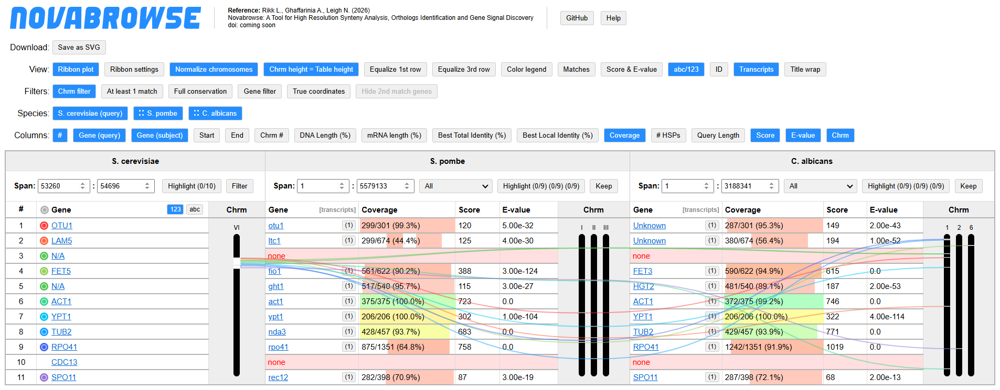


<br>


## Tutorial 2: Using Custom Sequences and Gene Signal Discovery

[Selmecki et al. (2005)](https://doi.org/10.1534/genetics.104.034652) identified the longest syntenic region between *C. albicans* and *S. cerevisiae* on chromosome 7, spanning 11 ORFs from *DCC1* to *PGS1*. In this tutorial, we'll examine this region using *LEU2* as our anchor gene, while demonstrating two features: custom query sequences and searches against genomes.

We'll set up two query species to demonstrate different workflows:
- ***C. albicans*** — NCBI-retrieved query genes combined with a custom sequence
- ***S. pombe*** — only custom query sequences, no NCBI retrieval

### 1. Finding sequence data for custom sequences

To create a custom sequence entry, you need to set nucleotide and protein sequences, plus genomic coordinates (`chromosome`, `start_position`, `end_position`).

When using `download_from_NCBI: True`, Novabrowse automatically retrieves sequences for genes within your specified coordinates. However, for this tutorial, to demonstrate the custom sequence workflow, we'll manually obtain those sequences from NCBI:

1. Open the gene page for [*C. albicans* *LEU2*](https://www.ncbi.nlm.nih.gov/gene/3638034) and from there open "[Transcripts and proteins table](https://www.ncbi.nlm.nih.gov/datasets/gene/3638034/#transcripts-and-proteins)":

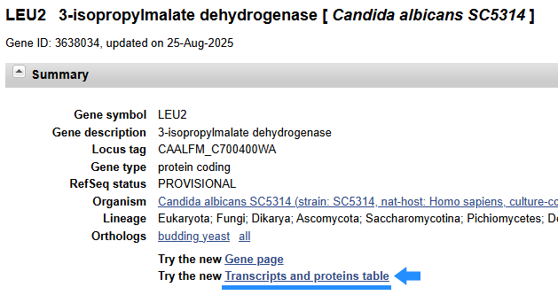

2. Then navigate to both the transcript ([XM_715278.1](https://www.ncbi.nlm.nih.gov/nuccore/XM_715278.1?report=fasta)) and protein ([XP_720371.1](https://www.ncbi.nlm.nih.gov/protein/XP_720371.1?report=fasta)) subpages:

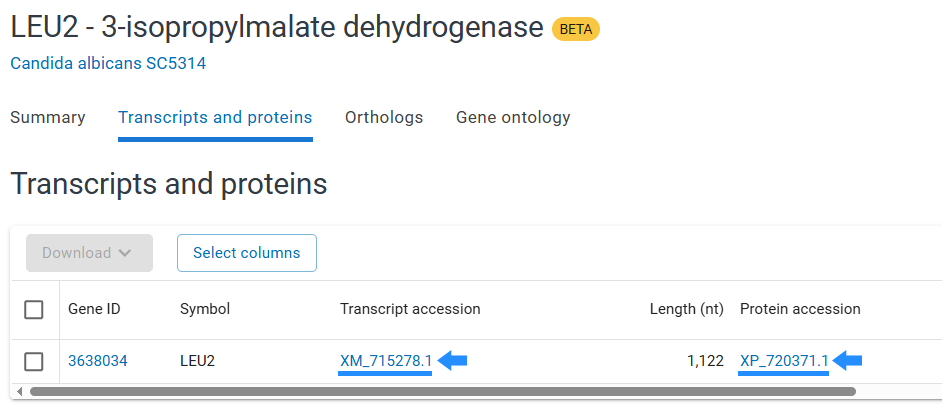

3. In the subpages select FASTA format:

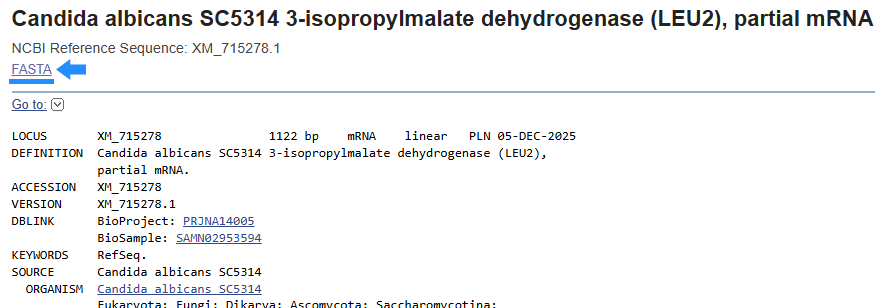

4. Finally, copy the sequence part only:

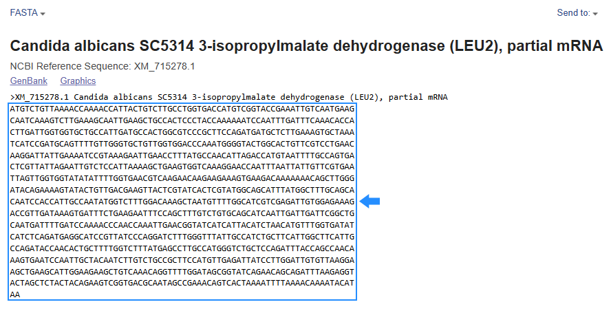

5. Each custom sequence also requires genomic context fields: `chromosome`, `start_position`, and `end_position`, which determine how the gene is positioned in the HTML output, and `id`, which is used to generate a hyperlink to the NCBI gene page (can be left blank if not needed). The `strand` field is stored in BLAST query headers for reference but does not affect the final HTML output (can be left as `"1"` if not needed). For this sample, we use the values from "Genomic context" section of the gene page and we get the `id` from the URL:

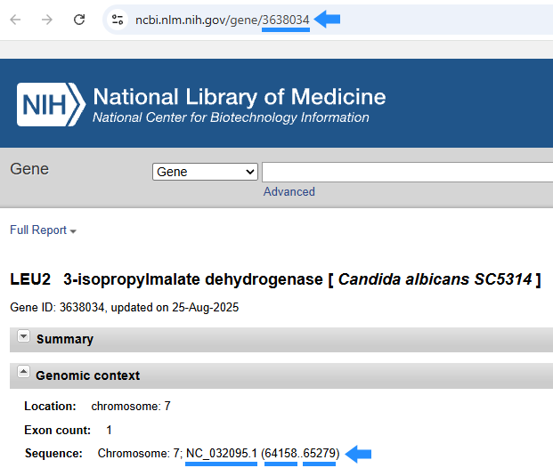

> **Note:** For *C. albicans* chromosome parameter, we use the NCBI accession (`NC_032095.1`) instead of the chromosome name because the NCBI Entrez API does not map the chromosome name correctly for this species. Either format works when supported (see [Chromosome identifiers](#1-setting-up-a-query) in Tutorial 1).

Repeat the same process for *S. pombe* [*leu2*](https://www.ncbi.nlm.nih.gov/gene/2543296) and [*sor1*](https://www.ncbi.nlm.nih.gov/gene/2543287) to obtain their sequences and genomic coordinates.

### 2. Adding custom sequences to your query

Add a `custom_sequences` array to include your own sequences. Note that `nucleotide_sequence` and `protein_sequence` must each be on a single line without line breaks. You can process multiple query species and multiple transcripts in one run:

```python
query_sequences_list = [
    {
        'query_species': 'c_albicans',
        'protein_sources': ('NP_','XP_'),
        'show_only_best_matches': 'Both',         # Generates two files: best hits only + all hits
        'retrieved_sequences': {
            'download_from_NCBI': True,            # Fetch flanking genes from NCBI
            'chromosome': 'NC_032095.1',           # Accession from "Genomic context" (see note above)
            'start_position': 64158,               # LEU2 start coordinate
            'end_position': 65279,                 # LEU2 end coordinate
            'genes_upstream': 7,                   # Include 7 genes before LEU2
            'genes_downstream': 11,                # Include 11 genes after LEU2
        },
        'custom_sequences': [
            {
                "name": "LEU2_custom",            # Your chosen display name
                "id": "3638034",                  # Gene ID from URL (ncbi.nlm.nih.gov/gene/[ID])
                "description": ">XP_720371.1 3-isopropylmalate dehydrogenase [Candida albicans SC5314]",  # FASTA header
                "nucleotide_sequence": "ATGTCTGTTAAAACCAAAACCATTACT...",  # Copy from transcript FASTA
                "protein_sequence": "MSVKTKTITVLPGDHVGTEIVNEAIKV...",     # Copy from protein FASTA
                "chromosome": "NC_032095.1",      # Accession from "Genomic context" (see note above)
                "strand": "1",                    # "1" = forward, "-1" = reverse
                "start_position": "64158",        # From gene page coordinates
                "end_position": "65279"           # From gene page coordinates
            },
        ]
    },
    # For S. pombe, we use only custom sequences to demonstrate multiple entries
    {
        'query_species': 's_pombe',
        'protein_sources': ('NP_','XP_'),
        'show_only_best_matches': 'False',
        'retrieved_sequences': {
            'download_from_NCBI': False,          # Only using custom sequences
            'chromosome': '',
            'start_position': 0,
            'end_position': 0,
            'genes_upstream': 0,
            'genes_downstream': 0,
        },
        'custom_sequences': [
            {
                "name": "leu2_custom",
                "id": "2543296",
                "description": ">NP_594576.1 3-isopropylmalate dehydratase Leu2 [Schizosaccharomyces pombe]",
                "nucleotide_sequence": "GTCCATAACCAAACACCAAGGATTTTT...",
                "protein_sequence": "MSPSVASPKTLYDKVWDSHVVDLQEDG...",
                "chromosome": "I",
                "strand": "1",
                "start_position": "4439855",
                "end_position": "4442513"
            },
            {
                "name": "sor1_custom",
                "id": "2543287",
                "description": ">NP_594578.1 sororin [Schizosaccharomyces pombe]",
                "nucleotide_sequence": "GTACGCAATATACAAAAGTGAAATGCA...",
                "protein_sequence": "MDSDDSFVKTAHVIETSTPENKKLSHR...",
                "chromosome": "I",
                "strand": "1",
                "start_position": "4444383",
                "end_position": "4446593"
            },
        ]
    },
]
```

> **Note:** In the *C. albicans* configuration above, `LEU2` (retrieved via `download_from_NCBI: True`) and `LEU2_custom` contain identical sequences. The tutorial intentionally includes the same gene twice (once from NCBI, once as custom) to demonstrate that they produce identical results.

### 3. Searching against genomes (gene signal discovery)

When searching against genomes, BLAST returns separate HSPs for each exon. The `consider_one_gene` parameter clusters nearby HSPs into gene units:

```python
consider_one_gene = 1050  # Longest known intron in S. cerevisiae (~1kb)
```

This enables **gene signal discovery** - finding potential unannotated genes. Note that intron sizes differ between species, good practice is to set this value similar to the largest known intron in your species to ensure all exons from the same gene are grouped correctly.

Enable genome searches by setting `type` to include `'genome'`:

```python
subject_species = {
   's_cerevisiae': {
       'enabled': True,
       'maximum_evalue': 1e-10,
       'minimum_score': 0,
       'additional_blast_parameters': '',
       'type': ['transcriptome', 'genome']  # Search both database types
   },
   # ... other species
}
```

### 4. Using tblastx for divergent species

For highly divergent species, `tblastx` (translated nucleotide vs translated nucleotide) can find matches that other BLAST algorithms might miss:

```python
blast_settings = {
    'blast_type': ['tblastn', 'tblastx'],
    'blast_options': '-outfmt 0 -num_threads 48'
}
```

### 5. Run the notebook

Run all notebook cells sequentially.

### 6. Find results in the `output/` folder as HTML files

> **Tip:** Compare your results with the reference files in the `tutorial/` folder:
> - `Novabrowse_LEU2_loci_synteny_c_albicans_tblastn_best_matches.html`
> - `Novabrowse_LEU2_loci_synteny_c_albicans_tblastn_all_matches.html`
> - `Novabrowse_LEU2_loci_synteny_c_albicans_tblastx_best_matches.html`
> - `Novabrowse_LEU2_loci_synteny_c_albicans_tblastx_all_matches.html`
> - `Novabrowse_LEU2_loci_synteny_s_pombe_tblastn_all_matches.html`
> - `Novabrowse_LEU2_loci_synteny_s_pombe_tblastx_all_matches.html`

<br>


# Documentation

## General Features

#### **BLAST Integration**
- **Multiple BLAST algorithms** - Support for BLASTn, tBLASTn, and tBLASTx with independent configuration per subject species
- **Automated NCBI retrieval** - Direct integration with NCBI E-utilities API for automatic gene sequence downloads
- **Custom sequence support** - Incorporate user-provided sequences (e.g., from nanopore sequencing) alongside NCBI data
- **Flexible filtering** - Configure E-value thresholds and bit score cutoffs independently per species
- **Automatic quality filtering** - Filters out discontinued and obsolete gene entries from NCBI
- **Gene signal discovery** - Detect unannotated genes in genome searches through HSP clustering (see [Configuration Reference](#gene-signal-discovery-consider_one_gene))
- **Smart gene naming** - Hierarchical fallback for display names when official nomenclature is unavailable

#### **Interactive Visualization**
- **High-resolution chromosomal maps** - Interactive chromosome visualizations showing precise gene positions with support for both single chromosomes and multi-arm configurations
- **Dynamic filtering system** - Filter by gene names, conservation levels, genomic coordinates, or match quality with real-time statistical updates
- **Isoform management** - Automatic consolidation of transcript isoforms with expandable views showing all variants and their alignment statistics
- **Coordinate-based highlighting** - Focus analysis on specific genomic regions through visual highlighting or selective display of genes within defined coordinate ranges

#### **Analysis Features**
- **Transcriptome and genome searches** - Search against both annotated transcriptomes (using GTF files) or raw genomes (with automatic HSP clustering)
- **Multi-arm chromosome support** - Proper coordinate transformation for chromosomes represented as separate p and q arms in assemblies
- **Alignment quality metrics** - Track coverage percentage, identity (both total and local), bit scores, E-values, and HSP counts
- **Publication-ready export** - Generate SVG files containing complete table structure, chromosome maps, and active ribbon visualizations for direct use in publications or further editing

#### **User Experience**
- **All-in-one HTML output** - Self-contained interactive HTML files with embedded JavaScript for dynamic filtering and visualization without requiring server-side processing
- **Batch processing** - Process multiple genomic regions and species within single execution runs
- **Column customization** - Toggle visibility and reorder data columns including coordinates, lengths, alignment statistics, and chromosome visualizations
- **Drag-and-drop organization** - Reorder subject species columns to facilitate comparative analysis

## Pipeline Overview


1. **Query and subject species selection** — The user selects a genomic region of interest in the **query species** by specifying chromosome coordinates and optional flanking genes. Query sequences can come from NCBI, be provided manually as custom sequences, or both. For each **subject species**, the user chooses the database type (transcriptome and/or genome), BLAST algorithm (BLASTn, tBLASTn, and/or tBLASTx), and filtering thresholds (minimum bit score and maximum E-value).

2. **Automated query sequence retrieval** — The pipeline retrieves transcript and peptide sequences from NCBI for all **query species** genes in the target region, including upstream and downstream flanking genes. Any custom sequences are also incorporated at this stage. The results are saved as FASTA files (`transcripts.fasta` and `proteins.fasta`).

   > **Note:** Subject species databases (FASTA files and GTF annotations) must be prepared manually before running the pipeline — see [Prepare subject species files](#1-prepare-subject-species-files).

3. **BLAST search and results filtering** — The pipeline runs BLAST searches against each configured **subject species** database. For transcriptome hits, results are matched to GTF annotation entries to retrieve gene names, chromosomal positions, and annotation details. BLAST may return one or more HSPs (aligned segments) per transcript, these are grouped under the matching gene and later visualized as a coverage bar in the final output. For genome hits, HSPs are clustered by a user-defined distance threshold to identify putative gene units where nearby HSPs are grouped and assigned unique identifiers (e.g., Gene_1, Gene_2, etc.).

4. **Data integration and table generation** — The pipeline combines query gene metadata (names, coordinates, lengths, among others) with the filtered BLAST results, maps each query gene to its ranked **subject species** matches, and compiles everything into an interactive HTML table.

## Basic Output Overview


> In this sample, four query genes are searched against three subject species. *Gene 1* and *Gene 4* each show a single best match in each subject species, representing straightforward one-to-one orthology. *Gene 2* shows red "**none**" where no match was found (**Subject Species 1** and **Subject Species 3**). *Gene 3* shows how multiple hits are displayed: for **Subject Species 1**, *Gene 3A* is the best match (likely ortholog), while *Gene 3B*, *Gene 3C*, and *Gene 9* appear as secondary matches (paralogs or distant homologs). The coverage bars reveal match extent and quality, *Gene 3A* covers ~65% of the query at high identity (mostly green bars), while *Gene 9* covers only ~38% (with low identity, orange and red coverage bars). **The ribbon plot** connects gene's chromosome position across species with colored ribbons, making syntenic relationships directly visible. Here, *Gene 1* is shown with a custom dashed red ribbon tracing its matches across all three species. *Gene 2* (green) only connects to **Subject Species 2**, since no match was found in the other two species. *Gene 4* (blue) shares synteny with *Gene 1* in **Subject Species 1** and **2**, where both genes sit close together on the same chromosome. However, in **Subject Species 3**, *Gene 1* and *Gene 4*, while remaining on the same chromosome, are positioned considerably farther apart, suggesting an expanded syntenic block

- **Query Species column** (left) — lists the genes used as BLAST queries.
- **Coverage column** — colored bars showing where HSPs align along the query sequence. Values are shown as percentages and absolute lengths (total aligned length / query transcript length). Bar colors indicate identity percentage per the color legend.
- **Chrm column** — chromosome visualizations showing relative gene positions, with heights normalized across the table.
- **Chrm # column** — chromosomal locations. Underscores denote different chromosome arms (e.g., 2_2, 3_1).
- **Yellow highlighting** — genes within a user-selected coordinate range are marked with a yellow background. The corresponding region also appears in dark yellow on the chromosome visualization.
- **Ribbon plot** — colored curved lines connecting genes across chromosome columns. Ribbon style (color, opacity, width, dashed/solid) is customizable.

## Parameters Reference

This section provides detailed documentation for all configuration parameters. For usage examples, see the tutorials above.

### Query Configuration (`query_sequences_list`)

| Parameter | Type | Description |
|-----------|------|-------------|
| `query_species` | string | Species name (must match `ASSEMBLY_MAPPING` key and folder name) |
| `protein_sources` | tuple | Filter genes by accession prefix. See [Protein Source Prefixes](#protein-source-prefixes) |
| `show_only_best_matches` | string | `'True'` (best match only), `'False'` (all matches), or `'Both'` (generates two separate HTML files) |

#### Retrieved Sequences (`retrieved_sequences`)

| Parameter | Type | Description |
|-----------|------|-------------|
| `download_from_NCBI` | bool | Set `False` to use only custom sequences |
| `chromosome` | string | Chromosome name (`'VI'`, `'2'`, `'2p'`) or NCBI accession (`'NC_001138.5'`) |
| `start_position` | int | Region start coordinate |
| `end_position` | int | Region end coordinate (must be > start_position) |
| `genes_upstream` | int | Number of flanking genes before region (uses adaptive range searching) |
| `genes_downstream` | int | Number of flanking genes after region (uses adaptive range searching) |

> **Note:** NCBI API rejects queries larger than ~8-10 MB. Reduce region size or gene counts if you get "HTTP Error 400".

#### Custom Sequences (`custom_sequences`)

Optional array for including user-provided sequences alongside NCBI data (e.g., from nanopore sequencing):

| Field | Type | Description |
|-------|------|-------------|
| `name` | string | Unique display name for results |
| `id` | string | Gene ID from NCBI URL, used to generate hyperlinks in the HTML output (can be left blank) |
| `description` | string | FASTA header description |
| `nucleotide_sequence` | string | DNA sequence |
| `protein_sequence` | string | Amino acid sequence |
| `chromosome` | string | Chromosome name (`'VI'`, `'2'`, `'2p'`) or NCBI accession (`'NC_001138.5'`) |
| `strand` | string | `"1"` (forward) or `"-1"` (reverse). Stored in BLAST query headers but does not affect the HTML output |
| `start_position` | string | Genomic start coordinate |
| `end_position` | string | Genomic end coordinate (must be > start_position) |

### BLAST Configuration

#### Gene Signal Discovery (`consider_one_gene`)

For genome searches (not transcriptomes), Novabrowse clusters nearby BLAST HSPs into gene units:

```python
consider_one_gene = 1050  # Maximum distance (bp) between HSPs to merge into one gene
```

HSPs within this distance are merged into a single entry with combined coverage. When BLASTing a transcript against a genome, HSPs correspond to exons and gaps between them are introns. Set this value similar to the largest intron in your species to ensure all exons from the same gene are grouped correctly.

#### BLAST Settings (`blast_settings`)

| Parameter | Type | Description |
|-----------|------|-------------|
| `blast_type` | list | Algorithm(s) to use: `['tblastn']`, `['blastn']`, `['tblastx']`, or combinations like `['tblastn', 'blastn']` |
| `blast_options` | string | Command-line options. `-outfmt 0` is required. `-num_threads` is auto-adjusted to available cores |

**BLAST algorithms:**
- `blastn` - nucleotide vs nucleotide (best for closely related species)
- `tblastn` - protein vs translated nucleotide (most common for cross-species)
- `tblastx` - translated nucleotide vs translated nucleotide (for divergent species)

### Subject Species Configuration (`subject_species`)

| Parameter | Type | Description |
|-----------|------|-------------|
| `enabled` | bool | `True` to include in analysis, `False` to skip |
| `maximum_evalue` | float | E-value threshold - hits above this are filtered out (e.g., `1e-10`) |
| `minimum_score` | int | Minimum bit score filter (`0` = no minimum) |
| `additional_blast_parameters` | string | Species-specific BLAST command-line options |
| `type` | list | Database type(s): `['transcriptome']`, `['genome']`, or `['transcriptome', 'genome']` for both |

> **Tip:** Set query species to `enabled: False` to avoid self-hits.

> **Output files:** Separate result files are generated for each combination of BLAST type × database type × species.

### Protein Source Prefixes

The `protein_sources` parameter filters genes by NCBI accession prefix:

| Prefix | Description |
|--------|-------------|
| `NP_` | RefSeq curated proteins (manually reviewed, highest quality) |
| `XP_` | RefSeq predicted proteins (computational models) |
| `XM_` | Predicted mRNA sequences (not experimentally validated) |
| `XR_` | RefSeq non-coding RNA |
| `YP_` | RefSeq provisional proteins |
| `WP_` | Non-redundant RefSeq proteins |
| `CAA_` | EMBL (European Molecular Biology Laboratory) entries |
| `BAD_` | DDBJ (DNA Data Bank of Japan) entries |

Only genes with at least one product matching these prefixes will be retrieved.

### Gene Name Assignment

When retrieving genes from NCBI, Novabrowse assigns display names using this fallback hierarchy:
1. Official gene symbol (e.g., `ACT1`)
2. Locus tag identifier (e.g., `CAALFM_C700260CA`)
3. First available synonym
4. `"Uncharacterized"` if no identifiers available

### UI Controls

The Novabrowse HTML output includes numerous interactive buttons organized into functional categories. Below is a complete reference for all available controls:

#### Download
- **Save as SVG** - Exports the current table view, including visible columns, chromosome visualizations, and active ribbons, as a vector SVG file ready for publication or editing in vector graphics software

#### View Controls
- **Ribbon plot** - Displays curved ribbons connecting homologous genes across species chromosomes, providing visual synteny relationships. Useful for quickly identifying conserved genomic neighborhoods
- **Ribbon settings** - Opens configuration panel to customize ribbon appearance (color, opacity, style) and enable selective display for specific genes
- **Normalize chromosomes** - When enabled, scales all chromosome visualizations to equal height for easier cross-species comparison. When disabled, chromosomes are sized proportionally to their actual lengths
- **Chrm height = Table height** - Controls chromosome column behavior. When active, chromosome visualizations scroll with the table. When inactive, chromosomes use sticky positioning and remain visible during scrolling
- **Equalize 1st row** - Adjusts species header widths to match the widest column, creating uniform spacing across the first row
- **Equalize 3rd row** - Standardizes data column widths within each species to match the widest column in that section
- **Color legend** - Toggles visibility of the match percentage color scale reference (shows identity percentage color coding from 0% to 120%+)
- **Matches** - Displays match count statistics in species headers (e.g., "Matches: 9" showing how many query genes have hits)
- **Score & E-value** - Shows BLAST filtering parameters in species headers (minimum score and maximum E-value thresholds used)
- **abc/123** - Controls visibility of alphabetical/numerical sorting buttons in the query species column
- **ID** - Toggles display of NCBI gene IDs in parentheses next to gene names (e.g., "foxp3 (12345)")
- **Transcripts** - Shows/hides transcript isoform counts and expandable transcript details for each gene match
- **Title wrap** - Enables text wrapping in species header cells to prevent horizontal overflow of long species names

#### Filters
- **Filter** (Gene name filter) - Activates filtering based on comma-separated gene names entered in the text box. Displays only matching genes and their homologs across all species
- **Gene filter** - Toggles visibility of the gene name text input box (useful for saving screen space when not actively filtering by gene names)
- **Chrm filter** - Shows/hides the coordinate range inputs and chromosome selection dropdowns used for position-based filtering
- **At least 1 match** - Displays only genes that have at least one homolog identified in any of the visible subject species (hides genes with no matches anywhere)
- **Full conservation** - Shows only genes with matches detected in every visible subject species, identifying universally conserved genes
- **True coordinates** - For multi-arm chromosomes (p/q arms), switches between cumulative positions (combined arms) and true per-arm coordinates. Useful for accurately identifying positions on specific chromosome arms
- **Hide 2nd match genes** - Removes secondary/paralog matches from the table, keeping only the highest-scoring match per gene per species. Simplifies view when focusing on primary orthologs
- **Filter** (Span filter) - Restricts table to show only query species genes falling within the specified start/end coordinate range
- **Highlight** - Applies yellow background highlighting to genes within the specified coordinate range across all species, allowing visual focus without hiding other genes
- **Keep** - More restrictive than Highlight - displays only genes that have matches on the selected chromosomes within the defined coordinate span. Removes entire chromosomes not selected via checkboxes

#### Species Controls
Species toggle buttons allow you to show or hide individual subject species columns. Drag-and-drop functionality enables reordering of species columns for customized comparative analysis.

#### Column Visibility Toggles
- **#** - Row numbering for easy reference and navigation through large gene lists
- **Gene (query)** - Query species gene names with NCBI links. Hiding this column removes the source gene identifiers
- **Gene (subject)** - Subject species gene names and IDs. Toggle to focus on other metrics when gene names are not needed
- **Start** - Genomic start coordinates for each gene. Useful for precise location mapping
- **End** - Genomic end coordinates for each gene. Combined with Start, defines exact gene boundaries
- **Chrm #** - Chromosome assignments (e.g., "I", "2", "X"). Essential for identifying which chromosome each match is located on
- **DNA Length (%)** - Ratio of subject DNA length to query DNA length as percentage. Values >100% indicate the subject gene is longer than query
- **mRNA length (%)** - Ratio of subject mRNA/transcript length to query length. Helps identify size differences between orthologs
- **Best Total Identity (%)** - Highest identity percentage across all aligned segments for this gene pair. Measures overall sequence similarity
- **Best Local Identity (%)** - Highest identity percentage within a single HSP (local alignment). Can be higher than total identity for highly conserved domains
- **Coverage** - Visual bars showing which portions of the query sequence align to the subject, color-coded by identity percentage. Critical for identifying partial vs complete matches
- **# HSPs** - Number of High-scoring Segment Pairs (alignment segments) detected. Multiple HSPs may indicate exon structure or domain conservation
- **Query Length** - Length of the query protein/transcript in amino acids or nucleotides. Provides scale reference for coverage interpretation
- **Score** - BLAST bit score indicating alignment strength. Database-size independent metric for comparing match quality
- **E-value** - Expect value indicating statistical significance. Lower values indicate more significant matches (database-size dependent)
- **Chrm** - Chromosome visualization columns showing gene positions on scaled chromosome maps with ribbon connections

#### Table Sorting
- **123** - Sorts genes by their genomic coordinates (numerical position order). Maintains genes in chromosomal order as they appear in the genome
- **abc** - Sorts genes alphabetically by name. Useful for finding specific genes quickly or grouping gene families

#### Gene Selection
Click gene names in the Query Species column to add or remove them from the filter text box for quick multi-gene selection. Use the checkbox beside each gene name to control its ribbon visibility - checked genes display their synteny ribbons, while unchecked genes hide their connections. The master checkbox in the header selects/deselects all genes simultaneously.

### Chromosome Filter

The chromosome filter row provides coordinate-based filtering for both query and subject species. Toggle its visibility with the **Chrm filter** button.

**Query Species**

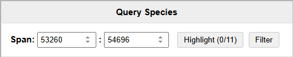

- **Span** — enter start and end coordinates to define a region of interest.
- **Highlight** — marks genes within the span with a yellow background and highlights the region on the chromosome visualization. The count shows matched genes vs total (e.g., `0/11`).
- **Filter** — hides all query genes outside the span from the table.

**Subject Species**

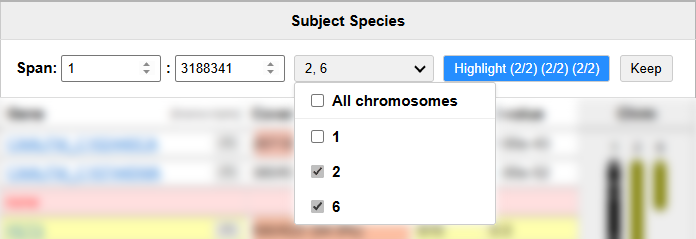

Each subject species has its own independent filter with additional controls:

- **Span** — enter start and end coordinates to define a region on the subject chromosome.
- **Chromosome dropdown** — select which chromosomes to include. Use "All chromosomes" to select or deselect all at once. Only checked chromosomes are affected by Highlight and Keep.
- **Highlight** — marks genes on the selected chromosomes within the span. The three counts show: query genes with matches (how many query genes have hits in this region) / unique subject genes (distinct genes matched) / total subject matches (includes duplicates, as the same subject gene can match multiple query genes). See [Highlight count example](#highlight-count-example) for further information
- **Keep** — the most restrictive filter. Hides all genes that don't have matches on the selected chromosomes within the span, and removes unselected chromosomes from the visualization.

#### Highlight count example
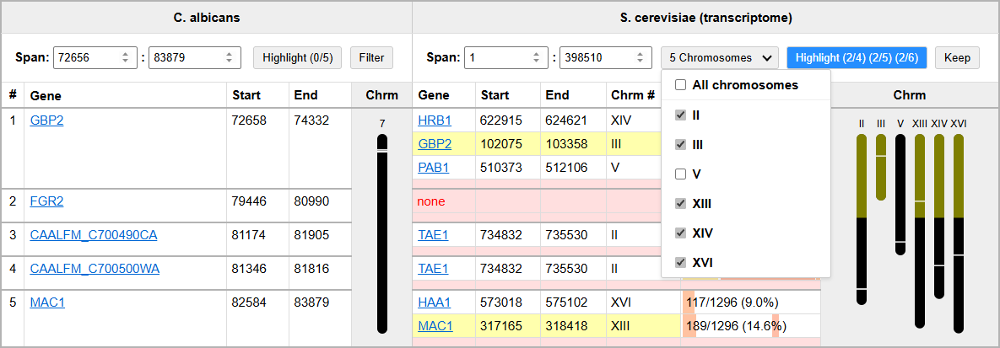

In this example, the *S. cerevisiae* subject species has span set to `1 : 398510` with chromosomes II, III, XIII, XIV, and XVI selected (V is unchecked). The button shows `Highlight (2/4) (2/5) (2/6)`:

**First count (2/4) — query genes with matches in region:**
- Even though we see **5** query genes in *C. albicans* column, only **4** query genes have matches to *S. cerevisiae* (note that *FGR2* has no match)
- Of those **4**, only **2** (*GBP2* and *MAC1*) have matches that fall within the span 1–398510
- *GBP2* matches to *GBP2* at position 102,075 on chromosome III (within span)
- *MAC1* matches to *MAC1* at position 317,165 on chromosome XIII (within span)
- The other matches (*HRB1* at 622,915, *TAE1* at 734,832, *HAA1* at 573,018) are outside the span

**Second count (2/5) — unique subject genes in region:**
- **5** unique *S. cerevisiae* genes exist on the selected chromosomes: *HRB1*, *GBP2*, *TAE1*, *HAA1*, and *MAC1* (*PAB1* on chromosome V is excluded because chromosome V is unchecked)
- Note that *TAE1* is matched by two different query genes (*CAALFM_C700490CA* and *CAALFM_C700500WA*), hence it only counts once toward the unique gene count
- Of those **5** unique genes, only **2** (*GBP2* and *MAC1*) are located within the span

**Third count (2/6) — total matches in region:**
- **6** total *C. albicans* genes match the *S. cerevisiae* genes on the selected chromosomes:
  1. *GBP2* → *HRB1* (XIV)
  2. *GBP2* → *GBP2* (III)
  3. *CAALFM_C700490CA* → *TAE1* (II)
  4. *CAALFM_C700500WA* → *TAE1* (II)
  5. *MAC1* → *HAA1* (XVI)
  6. *MAC1* → *MAC1* (XIII)

  (again note that *PAB1* on chromosome V is excluded, because chromosome V is unchecked)
- Of those **6** matches, only **2** fall within the span (*GBP2* → *GBP2* and *MAC1* → *MAC1*)

### Interactivity Features

**Table interactions**

- **Row hover highlighting** — hovering over any cell in a query gene's row highlights the entire row group (the main row plus all secondary match rows spanned by that gene). On the chromosome visualizations, the query gene and all its matching subject genes are marked with blue triangle indicators pointing to their exact positions. When a query gene has multiple matches in the same subject species (paralogs/secondary hits), all of them are highlighted together.

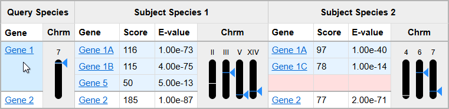

<blockquote style="margin-left: 40px;">Here the cursor hovers over <em>Gene 1</em> in the Query Species column. The entire row group (including secondary matches <em>Gene 1A</em>, <em>Gene 1B</em>, <em>Gene 5</em> in <b>Subject Species 1</b> and <em>Gene 1A</em>, <em>Gene 1C</em> in <b>Subject Species 2</b>) is highlighted. Blue triangles appear on every chromosome where a match exists, making it easy to see where the gene maps across all species at once.</blockquote>
<br>

- **Cross-species hover highlighting** — hovering over a subject species cell highlights that match's adjacent data columns within the species. On the chromosome visualizations, the hovered gene is marked with a blue triangle, along with the original query gene and its matches in every other subject species. Other matches of the same query gene within the hovered species (e.g., paralogs on different chromosomes) are marked with gray triangles, distinguishing them from the actively hovered match.

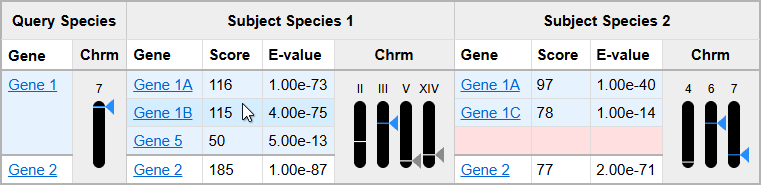

<blockquote style="margin-left: 40px;">Here the cursor hovers over <em>Gene 1B</em> in <b>Subject Species 1</b>. The hovered match gets a blue triangle on chromosome III, while the other matches in the same species (<em>Gene 1A</em> on chromosome II, <em>Gene 5</em> on XIV) receive gray triangles, enabling easy differentiation between the inspected match and the other paralogs in that species. Meanwhile, the query gene (<b>Query Species</b>, <em>Gene 1</em>) and matches in <b>Subject Species 2</b> all get blue triangles.</blockquote>
<br>

- **Transcript expansion** — click the expand transcripts button next to a match to reveal individual transcript isoforms with their score, e-value, mRNA length, identity percentages, coverage visualization, and query length. Click again to collapse.

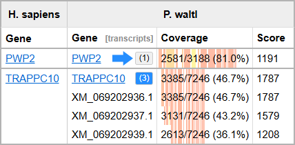

<blockquote style="margin-left: 40px;">In this example, <em>PWP2</em> shows <b>(1)</b> indicating a single transcript match (the arrow points to the expand transcripts button), while <em>TRAPPC10</em> is expanded showing <b>(3)</b> transcripts. The expanded view reveals individual isoforms (XM_069202936.1, XM_069202937.1, XM_069202939.1) with their coverage percentages and BLAST scores, allowing comparison of match quality across different transcript variants.</blockquote>
<br>

- **Coverage bar hover tooltip** — hovering over any colored segment in the coverage column displays a tooltip with detailed alignment statistics for that individual HSP (High-scoring Segment Pair).

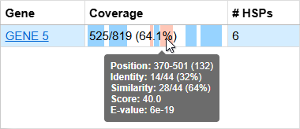

<blockquote style="margin-left: 40px;">

The tooltip displays:
- **Position** — the start and end coordinates of the HSP on the query sequence, with the aligned length in parentheses (e.g., `370-501 (132)` means positions 370 to 501, spanning 132 bases). A negative length (e.g., `501-370 (-130)`) indicates a reverse complement alignment where the HSP matches the antisense strand of the query.
- **Identity** — the number of exact nucleotide/amino acid matches out of the total aligned length, with the percentage (e.g., `14/44 (32%)`).
- **Similarity** — the number of positive-scoring positions (exact matches + conservative substitutions) out of the total aligned length, with the percentage (e.g., `28/44 (64%)`). For nucleotide BLAST this typically equals identity; for protein BLAST it includes biochemically similar substitutions.
- **Score** — the BLAST bit score for this HSP. Higher scores indicate stronger alignments.
- **E-value** — the BLAST expect value, representing the number of alignments with this score expected by chance. Lower values (e.g., `6e-19`) indicate more statistically significant matches.

**Reading the coverage bars:** each colored bar represents a single HSP positioned along the query sequence. Bar color reflects identity percentage: <span style="color: green;">**green**</span> for high identity (~100%), <span style="color: #cccc00;">**yellow**</span> for moderate (~75%), <span style="color: orange;">**orange**</span> for low (~50%), and <span style="color: red;">**red/pink**</span> for poor identity (~0%). The text overlay (e.g., `525/819 (64.1%)`) shows total unique coverage across all HSPs — overlapping regions are counted only once.

**HSP layering:** when multiple HSPs overlap the same query region, Novabrowse renders wider (longer) HSPs behind shorter ones, so all segments remain visible and hoverable. In the image above, two red bars are visible because a shorter HSP falls within the range of a longer one and is layered on top.

**Note:** a **1px white border** is added to the left and right edges of each bar, providing visual separation between adjacent or overlapping segments.

</blockquote>
<br>

**Chromosome visualization interactions**

- **Hover line indicator** — moving the mouse over a chromosome displays a white horizontal line that follows the cursor vertically, indicating the exact genomic position.
- **Position tooltip** — hovering over the chromosome shows a tooltip with the chromosome name and the calculated genomic coordinate at the cursor position.
- **Gene hover tooltip** — hovering over a gene line shows up multiple tooltips: chromosome name and gene starting coordinate on the chromosome, subject species gene name, and the query species gene name.

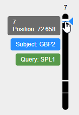

<blockquote style="margin-left: 40px;">In this example, the query gene name <em>SPL1</em> is different from the matching subject gene name <em>GBP2</em>. This kind of name mismatch is common and can be caused by paralogue matches (where the query gene matches a related but distinct gene in the subject species), different naming conventions across species, or independent discovery of the same gene in different organisms.</blockquote>

- **Click to copy position** — clicking on a chromosome copies the coordinate at that point to the clipboard. Clicking a gene rectangle copies the gene's start position. The tooltip briefly shows "copied" as confirmation.
- **Click gene to scroll** — clicking a gene rectangle on the chromosome scrolls the table to that gene's row and briefly flashes it yellow.

### Ribbon Plot Features

- **Ribbon Hover highlighting** — hovering over a gene's table row or its chromosome line turns that gene's ribbon black and bold, making it stand out from the others.

Each gene's ribbon can be individually customized. Click the ribbon settings button next to a gene name to open the settings panel.

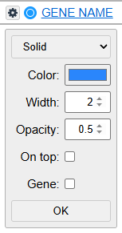

- **Color** — change the ribbon color using a color picker.
- **Width** — adjust the ribbon line thickness.
- **Opacity** — control ribbon transparency from 0 (fully transparent) to 1 (fully opaque). Useful for reducing visual clutter when many ribbons overlap.
- **Line style** — choose between Solid, Dashed, Dotted, or Dash-Dot patterns to visually distinguish specific ribbons.
- **On top** — pin a ribbon to always render above other ribbons, ensuring it remains visible even when overlapping with others.
- **Gene coloring** — colors that gene's rectangles (query and all its subject matches) on the chromosome visualizations with the ribbon's color, making it easy to spot the gene's position across species at a glance.

### Chromosome Data Format

The `chromosome_data.json` file stores chromosome accessions and lengths for each species. The notebook `get_chromosome_info.ipynb` generates this file automatically, but if NCBI doesn't have data for a species, you can add it manually using this structure:

```json
{
    "s_cerevisiae": {
        "assembly_id": "GCF_000146045.2",
        "chromosomes": [
            {
                "parts": [
                    {
                        "accession": "NC_001133.9",
                        "length": 230218,
                        "name": "I"
                    }
                ]
            },
            {
                "parts": [
                    {
                        "accession": "NC_001134.8",
                        "length": 813184,
                        "name": "II"
                    }
                ]
            }
        ]
    }
}
```

Each species contains an `assembly_id` and a `chromosomes` list. Each chromosome entry has a `parts` array with the chromosome `accession`, `length` (in base pairs), and `name` (as displayed in the output).

## Troubleshooting

### NCBI API errors

**"Search Backend failed" when running `get_chromosome_info.ipynb` or `novabrowse_1.0.ipynb`**
- This is an NCBI server-side issue, not a problem with your code
- Wait and try again later. These errors usually resolve within a few hours
- You can check if the NCBI API is working by opening [this link](https://eutils.ncbi.nlm.nih.gov/entrez/eutils/esearch.fcgi?db=nuccore&term=GCF_000146045.2[Assembly]&retmax=1) in your browser. If the API is down, the response will contain `<ERROR>Search Backend failed</ERROR>` instead of search results

**"HTTP Error 400" from NCBI**
- NCBI API has limits on query size (~8-10 MB)
- Reduce the genomic region size (`start_position`/`end_position`) or number of `genes_upstream`/`genes_downstream`

**"Entrez email is not set"**
- Set the `ENTREZ_EMAIL_ENV` environment variable or define `entrez_email` in the notebook/YAML config
- See [Set up NCBI email](#3-set-up-ncbi-email) for instructions

**"Failed after N attempts" (retry exhaustion)**
- NCBI API calls failed repeatedly due to network issues or server overload
- Check your internet connection and try again later

### Chromosome data errors

**`KeyError: '<species_name>'` in `generate_main_comparison`**
- The species is missing from `chromosome_data.json`
- Run `get_chromosome_info.ipynb` again. If NCBI was down during the previous run, some species may have been skipped
- Both query and subject species must have entries in `chromosome_data.json`
- If NCBI does not have chromosome data for your species, add it manually (see [Chromosome Data Format](#chromosome-data-format))

**"No chromosome information found for [species]"**
- NCBI returned no RefSeq chromosome sequences for that assembly accession
- Verify the assembly accession is correct in `ASSEMBLY_MAPPING`
- If NCBI's servers were down, try again later
- For species without RefSeq chromosome records, add the data manually (see [Chromosome Data Format](#chromosome-data-format))

**"Could not find chromosome [name] in [species]"**
- The chromosome name in your query does not match any entry in `chromosome_data.json`
- Check the chromosome naming format. NCBI may use `6`, `VI`, `6p`/`6q`, or accession identifiers like `NC_001138.5` depending on the species

### BLAST errors

**"makeblastdb not found"**
- Ensure BLAST+ is installed and in your PATH
- Try running `makeblastdb -version` to verify

**"Query file not found" or "BLAST completed but output file not created"**
- Check that the FASTA files in `1_subject_sequences/` match the filenames in your configuration
- Transcriptome files must be named exactly `rna.fna`; genome files must contain `_genomic` in the filename

**"No GCF directory found for [species]"**
- The BLAST database directory for that species is missing from `2_subject_blastdb/`
- Run `make_blastdb.ipynb` first to create the databases

**"Unsupported BLAST type"**
- `blast_type` must be one of: `tblastn`, `blastn`, `tblastx`

### Configuration errors

**"Invalid species. Must be one of: [list]"**
- The species name in your query does not match any key in the `subject_species` configuration
- Species names must match exactly between `ASSEMBLY_MAPPING`, `subject_species`, and `species_to_orgn`

**No genes found in the specified region**
- Check that the chromosome format matches NCBI naming for your species
- Verify genomic coordinates are correct for your assembly version
- Try expanding the region or increasing `genes_upstream`/`genes_downstream`

**YAML configuration file not found (Docker/Apptainer)**
- Make sure `novabrowse_config.yaml` exists in the repository's top-level directory
- If using a custom config file, pass it with `-e NOVABROWSE_CONFIG=./your_config.yaml`

## FAQ

### What is a synteny plot?
A synteny plot visualizes conserved gene order between species. Novabrowse generates interactive synteny plots as ribbon diagrams connecting orthologous genes across chromosome columns, letting you compare gene arrangements across multiple species simultaneously.

### How to interpret BLAST results?
Novabrowse parses raw BLAST output and presents it as an interactive HTML table with color-coded coverage bars showing alignment identity, chromosome maps showing hit locations, and synteny ribbons connecting matches across species. This replaces manual inspection of plain-text BLAST output.

### How do I find gene position on chromosome?
Novabrowse displays gene position on chromosome ideograms in the results table. Define a genomic region by coordinates, and Novabrowse retrieves all genes in that region and maps both query and subject gene hits onto their respective chromosomes.

### Is Novabrowse a sequence alignment viewer?
Yes. Novabrowse is a sequence alignment viewer that displays BLAST alignments as color-coded coverage bars positioned along query sequences, where colors indicate identity percentage. It also consolidates multiple transcript isoform hits into single gene entries.

### Is Novabrowse a blast graphical viewer?
Yes. Novabrowse works as a blast graphical viewer, displaying alignments as visual coverage bars with identity coloring, gene-level hit summaries, and chromosome context. It supports BLASTn, tBLASTn, and tBLASTx output.

### Is Novabrowse a comparative genomics tool?
Yes. Novabrowse is a comparative genomics tool that combines BLAST searching, multi-species synteny visualization, chromosome mapping, and coverage analysis in a single pipeline. See the [feature comparison table](#why-choose-novabrowse) for a detailed breakdown.

### Can Novabrowse be used as an ortholog finder?
Yes. Novabrowse functions as an ortholog finder by running BLAST searches against multiple subject species and ranking matches by score and E-value. The synteny ribbon plot helps distinguish true orthologs from paralogs by showing whether gene order is conserved.

## License

Novabrowse is released under the MIT License. See [LICENSE](LICENSE) for details.

## Citation

If you use Novabrowse in your research, please cite:
```
Rikk L., Ghaffarinia A., Leigh N. (2026)
Novabrowse: A Tool for High-Resolution Synteny Analysis, Ortholog Detection and Gene Signal Discovery
[Preprint link coming soon]
```

## Contributing

Contributions are welcome! Please feel free to submit a Pull Request.